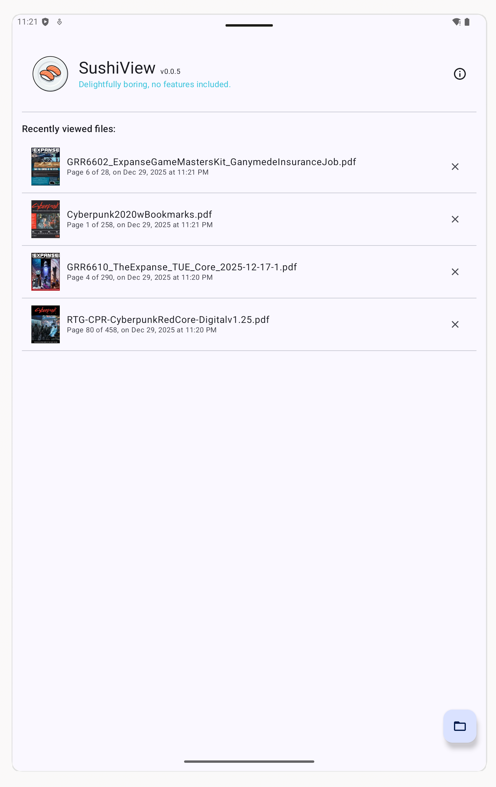
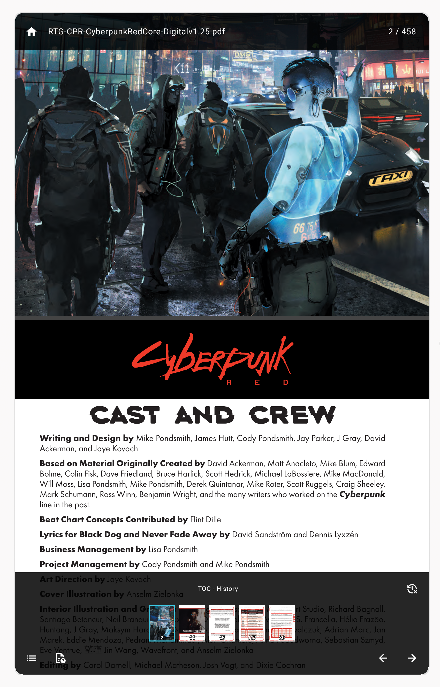

# SushiView

A bloat-free, minimal PDF reader for Android. No AI, no cloud sync.

Just PDF reading.

## The story

I wanted a simple PDF reader for my TTRPG manuals. They all sucked, so I sort of made my own (see XKCD 927).

## Download

## Features (as if ...)

- PDF rendering with vertical scrolling
- Table of contents navigation with browser-style back/forward
- Last reading position restored on re-open (hopefully)
- Minimal permissions; only file access
- No ads, no tracking, no internet required

## Screenshots

A couple of screenshots from Android emulator, just to show you how utterly boring is this reader.

  
  

## Requirements

Android 11 (API 30) or higher

## Known Issues

Closing a document when content is zoomed-in, and opening some other document, will carry the zoom
level from the previous document. 

## Support

If you find SushiView somewhat useful, you can buy me a coffee!

Disclaimer: I don't drink coffee, I will spend the money on cheap electronics.

## License

SushiView - Copyright (c) 2024 David Klasinc

You may download and use this software for personal use. Redistribution, modification, or reverse
engineering is not permitted. The software is provided "as is" without warranty of any kind. When I
overcome my dreadful anxiety I might even open source this thing.
